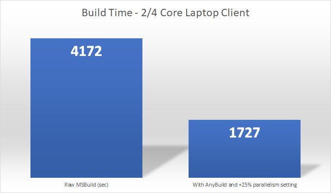

# Microsoft AnyBuild

AnyBuild is a build remote execution system that allows seamlessly remoting developer desktop and CI build agent load into Microsoft Azure. For larger code repositories this can result in significant speedups, particularly for less capable dev machines and build VMs. AnyBuild remotes the most expensive operations while leaving small build-test-rebuild commands just as fast.

* See the BazelCon 2019 (December 12, 2019) materials:
  * [Slides](https://docs.google.com/presentation/d/1RUh2nju6JfBYERdo6G2G3nA3H2ge-9GoDNYxu8zNRKw/edit?usp=sharing)
  * [Bazel Loopback Demo Video](https://drive.google.com/open?id=1hO2hDE6EFebbK38AM0BkW7t1pFArg-g5)
  * [Bazel 632 Azure Agent Demo Video](https://drive.google.com/open?id=1QZ2UgMQZsI9600Ja-GdlFRnivd_KQIWu)
  * [Recorded talk](https://youtu.be/q3RAOwezexU)
  * The BuildXL Two-Phase Cache algorithm, crucial to handling uncertainty in predicted inputs and different from the Bazel cache, is covered in the [BuildXL documentation](https://github.com/Microsoft/BuildXL/blob/master/Public/Src/Cache/README.md).
* An older set of slides from the [London Build Meetup](http://build-london.com/) (October 1, 2019) [slides](./docs/presentations/20191001_MicrosoftRemoteExecution_LondonBuildMeetup.pptx).
* A slightly updated but much shorter version for the Facebook Seattle CI Meetup (November 20, 2019) is [here](./docs/presentations/20191120_MicrosoftRemoteExecution_FacebookCIMeetup.pptx).

AnyBuild handles build engines like [MSBuild](https://github.com/Microsoft/MSBuild) and Gulp that do not specify inputs and outputs sufficiently for caching, and tools that bleed machine-specific paths into their outputs. Its Azure build agents do not need pre-installed tools; the tools are uploaded from the dev machine dynamically, cached for reuse, and executed under the same drive letters and paths as they would be on the dev machine or build agent, resulting in the same build outputs.

AnyBuild also has an adapter-proxy for Bazel Remote Execution that intercepts the Bazel RE API, does tool and SDK path prediction and upload, and runs the AnyBuild API into Azure to handle files and directories missed by prediction. At BaelCon 2019 we demontrated a single unmodified Bazel client running a highly parallel build against over 600 AnyBuild agents simultaneously, using the exact tool and SDK files installed on the client machine and without installing anything on the Azure agents.

AnyBuild is based on sandboxing, caching, and virtualization technologies originally developed for [Build Accelerator (BuildXL)](https://github.com/Microsoft/BuildXL), mixed with the Projected Filesystem (ProjFS) filesystem virtualization driver originally created for the [Virtual Filesystem for Git](https://github.com/Microsoft/VFSForGit) (formerly GVFS) on Windows 10. Its wire protocol is based on Google's Bazel [Remote Execution API](https://github.com/bazelbuild/remote-apis).

For a moderately large C++ heavy repo (500 proj files, 300 of them vcxproj) inside of Microsoft we see speedups of up to 40% on capable dev machines (6/12 cores, 64GB memory, SSD code drive) and much higher speedups for laptops and other lower-end client hardware.

(As of Oct 24, 2019. 19 build agents plus service coordinator VM in shared 100-core team pool with from 2 to 32 cores per agent, Azure D2 v2 Windows SKU, which would cost approximately $2500/month in VM time when running with dynamic VM scaling and business hours minimum sizing and paying full retail per-hour prices. cl.exe remoting only. Debug full build with no LTCG linking. MSBuild parallelism settings at +25% meaning /m:15 for the 6/12 core and /m:5 for the 2/4 core. AnyBuild MinParallelism=3 to remote only larger compilations.)

## More Details
AnyBuild provides the following benefits for developers:

* It extends a developer machine or build machine into the cloud by providing more cores, memory, and disk I/O buses to parallelize CPU-, memory-, and I/O-intensive build processes.
* Typically we increase the parallelism settings for MSBuild by 25-100%.
* It provides fast initial and upgrade deployment of its Azure virtual machines as a shared pool for one or more developers in a team, flexible cost-benefit tradeoffs in the number and size of build agents, and control of when to turn the agent pool off and on to save costs. It's in your Azure subscription, under your control.
* It solves the build agent installation problem: Instead of requiring installation of SDKs, packages, NodeJS and NPM, Python and Pip, and other artifacts onto remote exec agents, and trying to match client to agents at provisioning time, AnyBuild completely virtualizes the client machine filesystem into agents that have few or no installed components. Anything the user has installed that is needed for the build is added to the agent Content Addressable Store if not already available from previous runs. This provides a correct binary execution experience with a one-time cost to upload anything unique to a dev machine in the wild.
* It supports incomplete input and output prediction - "non-hermetic actions" in Bazel terminology. Bazel and Goma require complete input file and directory, and output directory, prediction per remoted process or command. AnyBuild supports pluggable input and output predictors, but if the predictors are incomplete or buggy, or there is no predictor available, AnyBuild provides a correct - but slower - experience for the user by reaching back to the user's machine to get missing input files. The agent uses BuildXL sandboxing to watch the process execution and gather all of its outputs for return to the client machine.
* Support for tools that rely on fully qualified paths: AnyBuild remotes all drive letters on a Windows dev machine, and executes processes within a virtualized environment that provides the exact same working directory and absolute paths.

### What it doesn't do
* No registry remoting at this time. Tools must not rely on the agent's registry as there is nothing installed there but a base Windows 10 1903+ image.

## Remoting More Than MSBuild
With specific settings you can remote just about anything, and wrap just about any top-level build engine process. AnyBuild uses Windows [Detours](https://github.com/Microsoft/Detours) logic to hook CreateProcess calls and decides what to remote and what to run locally.

We've run Gulp builds with remoting of Mocha unit tests. If the top-level build tool is a graphics rendering coordinator that can run multiple sub-processes in parallel, you can remote the rendering jobs to beefy multi-core or GPU-enabled agents (of course, check your software's licensing agreements, and remember if it checks the registry it's not going to work). Refactor a TensorFlow training set, e.g. hyperparameter space searches, into multiple parallel sub-processes run under a build engine and remote the individual training processes to GPU-enabled agents.

# Contributing
See [CONTRIBUTING](CONTRIBUTING.md).
