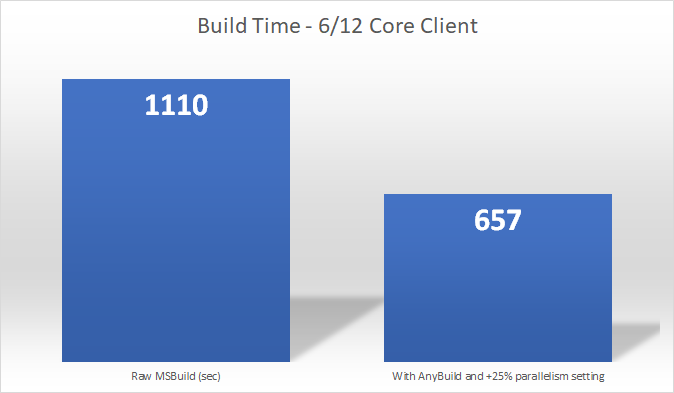

# Microsoft AnyBuild

## Introduction
AnyBuild is a forthcoming open source release of a build remote execution system that allows seamlessly remoting developer desktop and build agent load into Microsoft Azure. For larger code repositories this can result in significant speedups, particularly for less capable dev machines and build VMs.

AnyBuild handles build engines like [MSBuild](https://github.com/Microsoft/MSBuild) that do not specify inputs and outputs sufficiently for caching, and tools that bleed machine-specific paths into their outputs. Its Azure build agents do not need pre-installed tools; the tools are uploaded from the dev machine dynamically, cached for reuse, and executed under the same drive letters and paths as they would be on the dev machine or build agent, resulting in the same build outputs.

AnyBuild is based on sandboxing, caching, and virtualization technologies originally developed for [Build Accelerator (BuildXL)](https://github.com/Microsoft/BuildXL), mixed with the Projected Filesystem (ProjFS) filesystem virtualization driver originally created for the [Virtual Filesystem for Git](https://github.com/Microsoft/VFSForGit) (formerly GVFS) on Windows 10. Its wire protocol is based on Google's Bazel [Remote Execution API](https://github.com/bazelbuild/remote-apis).

For a moderately large C++ heavy repo inside of Microsoft we see speedups of up to 25% on capable dev machines (6/12 core, 64GB memory, SSD code drive) and much higher speedups for laptops and other lower-end client hardware.

## More Details
AnyBuild provides the following benefits for developers:

* It extends a developer machine or build machine into the cloud by providing more cores, memory, and disk I/O buses to parallelize CPU-, memory-, and I/O-intensive build processes.
* It provides fast initial and upgrade deployment of Azure virtual machines as a shared pool for one or more developers in a team, flexible cost-benefit tradeoffs in the number and size of build agents, and control of when to turn the agent pool off and on to save costs. It's in your Auzre subscription, under your control.
* It solves the build agent installation problem: Instead of requiring installation of SDKs, packages, NodeJS and NPM, Python and Pip, and other artifacts onto remote exec agents, and trying to match client to agents at provisioning time, AnyBuild completely virtualizes the client machine filesystem into agents that have few or no installed components. Anything the user has installed that is needed for the build is added to the agent Content Addressable Store if not already available from previous runs. This provides a correct binary execution experience with a one-time cost to upload anything unique to a dev machine in the wild.
* It supports incomplete input and output prediction - "non-hermetic" in Bazel terminology. Bazel and Goma require complete input file and directory, and output directory, prediction per remoted process or command. AnyBuild supports pluggable input and output predictors, but if the predictors are incomplete or buggy, or there is no predictor available, AnyBuild provides a correct - but slower - experience for the user by reaching back to the user's machine to get missing inputs. The agent uses BuildXL sandboxing to watch the process execution and gather all of its outputs for return to the client machine.
* Support for tools that rely on fully qualified paths: AnyBuild remotes all drive letters on a Windows dev machine, and executes processes within a virtualized environment that provides the exact same working directory and absolute paths.

# Contributing
See [CONTRIBUTING](CONTRIBUTING.md).
